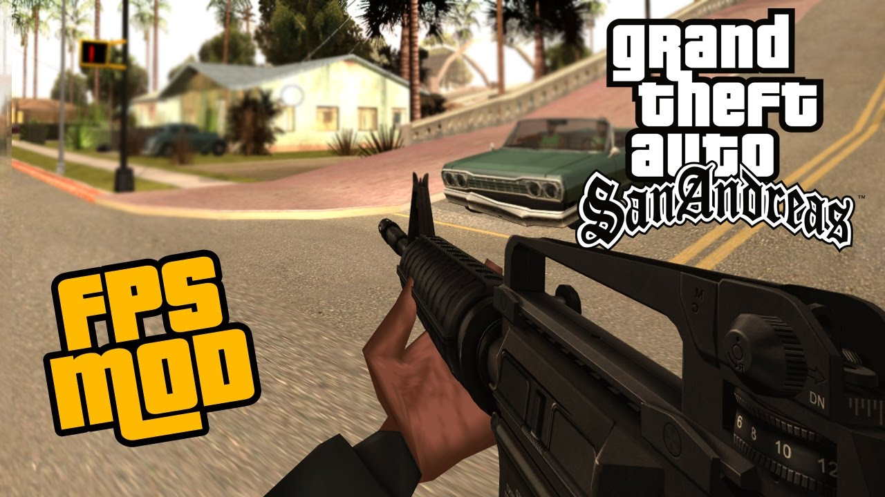

# GTA SAN ANDREAS First Person Mod

  

## Hi, amigo vato loco ;-) ! 🎮

Welcome to the world of Grand Theft Auto: San Andreas in First Person !

### How to Get Started?

To play GTA San Andreas in First Person, follow these simple steps:

0. **Clone this Github repo on your computer** Put this repo folder anywhere you like.

1. **Install GTA San Andreas** You must have GTA San Andreas installed on your computer. From Steam, Rockstar Games Launcher, or pirated, whatever ;-) . Once installed, run it at least once, all the way up to that backalley with a bicycle. You can then exit the game.
That's needed to ensure that everything works fine, before going further.

2. **Run The GTA San Andreas Downgrader tool** 
Download the Downgrader. This tool allows us to downgrade GTA San Andreas to version 1.0 . This is needed because the other versions are known to have some annoying bugs, and also, we need v1.0 to be able to install mods to the game. The download link is right below:

https://drive.google.com/file/d/16Zps6OCAbXTUSY-ah6HODw5Z5cyYAjYS/view

This link above comes from this well known youtube video from Vadim M
https://www.youtube.com/watch?v=mZVuYZrtHWo

Once downloaded, extract the zip archive into a folder 
(using 7zip or WinRar) , 
and then run the tool named sadowngrade1-4-0.exe . 
A disclaimer will pop up. Answer 'Yes'.

click Browse on the top right corner, and select your 
GTA San Andreas's gta-sa.exe file, if not already selected (it sould be automatic) in the install folder.

Once done, a scanning will start. Wait for the scanning and installing
of things. Once the scanning is complete, click the
'Downgrade' button on the bottom right corner of the window.

A message will show up, asking you if you want to copy the GTA SA install folder and create a new game folder specifically downgraded.
Say 'Yes', and select a folder of your choice, where the new downgraded game foler will exist.

Then wait for the new folder creation. Once that's done, the downgrading is successful !! You will see a brand new icon named 
'GTA San Andreas V1'
on your Desktop. That's the icon you should use to run the downgraded game. Don't use it right now !!!! Wait for next step.

3. **Install Silent Patch and Silent's ASI Loader**
These can be found at 
https://cookieplmonster.github.io/mods/gta-sa/
and 
https://cookieplmonster.github.io/mods/gta-sa/#asiloader
respectively.
Extract the downloaded archives, and put all the files within those archives, into the downgraded GTA SA Folder.
Now test GTA San Andreas V1.

4. **Install the Widescreen Fix**
You can find it here
https://github.com/ThirteenAG/WidescreenFixesPack/releases/tag/gtasa
Download the GTASA.WidescreenFix.zip file,
and Extract the archive to the GTA SA Downgraded folder, as usual, you know the drill. Test GTA San Andreas V1 !!

5. **Installe CLEO**
Here https://github.com/cleolibrary/CLEO4/releases/tag/v4.4.3
CLEO4.zip,
Download and Extract the archive to the GTA SA Downgraded folder, as usual, you know the drill. Test GTA San Andreas V1 !!

6. **Installe Zolika's Trainer**
Here https://zolika.dev/mods/samenu
Download and Extract the archive to the GTA SA Downgraded folder, as usual, you know the drill. 

7. **Test Zolika's first person mod**
Start GTA San Andreas, with the 'GTA SAN ANDREAS V1' icon, on your Desktop.

Once in-game, press F7 to use the Zolika's ZMenu.

Navigate to:

Options > Camera Options > Custom Cameras > First Person

Set Enabled to On

Set FOV to 110

Set Rotate Player with Camera to On, 
if you want to go where you watch

Set Rotate Player with Camera to Off, if you want to keep walking in the same direction, while being able to look around.

Here's the controls available, when using the Zolika's Mod:

(NOTE FOR LAPTOP USERS: The Num0-9 keys are available on laptops without a dedicated NumPad !! When you press the VerrNum key, watch for those letter keys with a number in it. If your laptop's keyboard has a NumPad, then ignore this note)

F7 - open/close menu
Num5 - enter menu
Num0 - exit menu
Num2/8 - scroll

Default hotkeys:
RCTRL + Num1 - Fix Car
RCTRL + Num2 - Flip Car
RCTRL + Num3 - Clean Car
RCTRL + F2 - Toggle Special Godmode
Semicolon - Infinite Ammo
0 - Always Godmode
Apostrophe - Move forward through door
Square bracket left - Never Wanted
Square bracket right - Car Speedup
F6 - Airbreak
