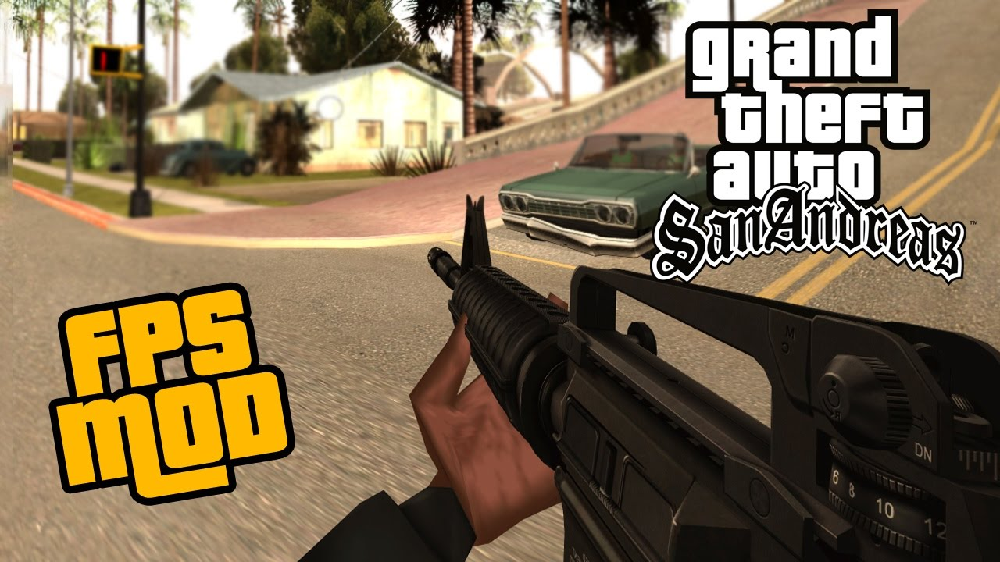

# GTA SAN ANDREAS VR Mod 🌎

<p align="center">
  
</p>

## Hi, amigo vato loco ;-) ! 🎮

Welcome to the world of Grand Theft Auto: San Andreas in VR !

The goal of Github repository is to document the process of turning Grand Theft Auto: San Andreas Definitive Edition into a VR game, thanks to the fantastic UEVR Mod from Lord Praydog

https://github.com/praydog/UEVR

If the documentation scares you, don't worry ! This README describes in detail each step from zero to hero ;-)

## Step By Step Process

- Download and install the `.Net Runtime` and the `.Net Desktop Runtime` at

https://dotnet.microsoft.com/en-us/download/dotnet/6.0

- Before downloading UEVR, Add your Downloads folder to the exclusion list of your Firewall shizzle

see https://superuser.com/a/1565786 for the how-to

- Download the latest UEVR Injector at 

https://github.com/praydog/UEVR/releases/latest/download/UEVR.zip

- Extract the zip file into a folder.

- Create shortcut for `UEVRInjector.exe` in your Desktop, for convenience.

- Open the `UEVRInjector.exe` file 
(AS ADMINISTRATOR !!!!!) 
inside the extracted folder.

- Open `GTA San Andreas Definitive Edition`

- Press `Alt + Tab` or `Win Key` or whatever yours is, to make the UEVR menu appear in game, while the game is running.

- Click the little arrow on the top right corner of UEVR,
and select the process corresponding to GTA SA.
It should normally be called `SanAndreas (pid: 912) (Grand Theft Auto: San Andreas - The Definitive Edition)`

- Make sure your VR headset is connected and ready, via `Virtual Desktop` or `Link/AirLink` or whatever your shizzle is ;-)

- Click on `Inject`

- Now, the game is projected into your headset. To toggle the UEVR Menu ON/OFF, Press `Inser` on your keyboard, or `L3 + R3` on your gamepad.

(Please note that the UEVR menu toggle works only with a PC gamepad, not with the VR controller, at least in my case, using a Oculus Quest 2. Yours may vary.)

### To be in first person mode

This setup comes from this video, starting at 6:32

https://youtube.com/clip/Ugkx1A9DVj7hwPEf6L0UNmo9HKyKJQQSzK7Z?si=prmGO1gk3vdw7K2a

- Pause the game, and go to the `GRAPHICS` menu.

- Turn ``World Shadow Quality` to `OFF` , to disable shadows, because the in-game shadows are buggy and cause crashes in UEVR (the shadows are displayed in one eye only).

- Toggle `Show advanced settings` on, in the UEVR menu, so the `UObjectHook` menu appears.

- Click on `UObjectHook/main` ,  then click on `Spawn Overlapper`

- Click on `Objects by class` and type (in capital letters !)

```
GTASK
```

to find the specific setting we need. It will narrow down the list of game objects.

- Click on `BlueprintGeneratedClass/Game/SanAndreas/Characters/Player/BP_Player......`

- Click on `BP_Player_Character_C/Game/SanAndreas/Maps/SAWorld/SAWorld......`

- Click on `Attach Camera to (Relative)` 

- Press your RT (Right Trigger) of your PC controller, and use your left and right stick to adjust the camera. Put in inside CJ's head, like at his brain position, or above, you decide how low or high you want it

RT + Left Stick: Move the camera left/right/forward/back
RT + Right Stick: Move the camera up/down
RT + B: Reset camera offset
RT + Y: Recenter view
RT + X: Reset standing origin

- click on `Components` , then click on `GTAPoseableComponent head`

- Toggle `Visible` OFF, then click on `Save Visibility State`

- Click on `Config` , and toggle `Enabled At Startup` ON

- Get out of the `UObjectHook` menu, and go to the `VR` menu, then click on `Camera`

- Toggle `Decoupled Pitch` ON

That's it ! This first person setup is not perfect, but it is 100% playable and fun as it is ;-)

### Let's create a motion controls plugin for driving cars with our VR hands ;-)

Among all the motion controls, the driving motion controls are the most important ones, especially in a game like GTA where driving is a major part of the experience, so, let's roll our sleeves up and let's figure out how to do this.

We will need to create a UEVR plugin to handle this. 

We can create plugins in C++ or Blueprint, or LUA. Let's create a C++ plugin.

Let's setup our computer for C++ compilation. I assume you're using a Windows computer, so if you don't, Google for C++ setup for your OS.

Follow this tutorial, to setup the C++ shizzle.

https://code.visualstudio.com/docs/languages/cpp
